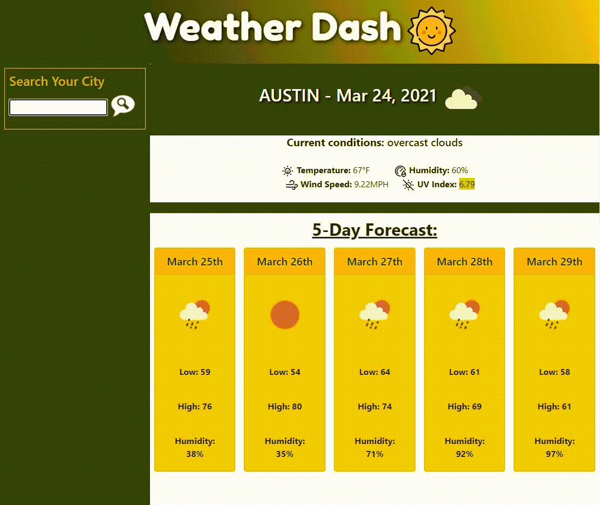

# WEATHER DASH  🌞

A simple web-app that allows you to search for a city and get the current weather and 5 day forecast. 

### Usage

1. Type the name of the city in the field provided and press enter to search by that location.
2. You can also click one of the buttons under the search form to re-select a previous city search and pull up weather on that city.

### Tools Used

- [OpenWeather's Current Weather and One Call APIs](https://openweathermap.org/api)
- [Bootstrap](https://getbootstrap.com/)
- [JQuery](https://jquery.com/)
- [Moment.js](https://momentjs.com/)

### [Check it out here.](https://jshmtchll.github.io/weather-dash/)

